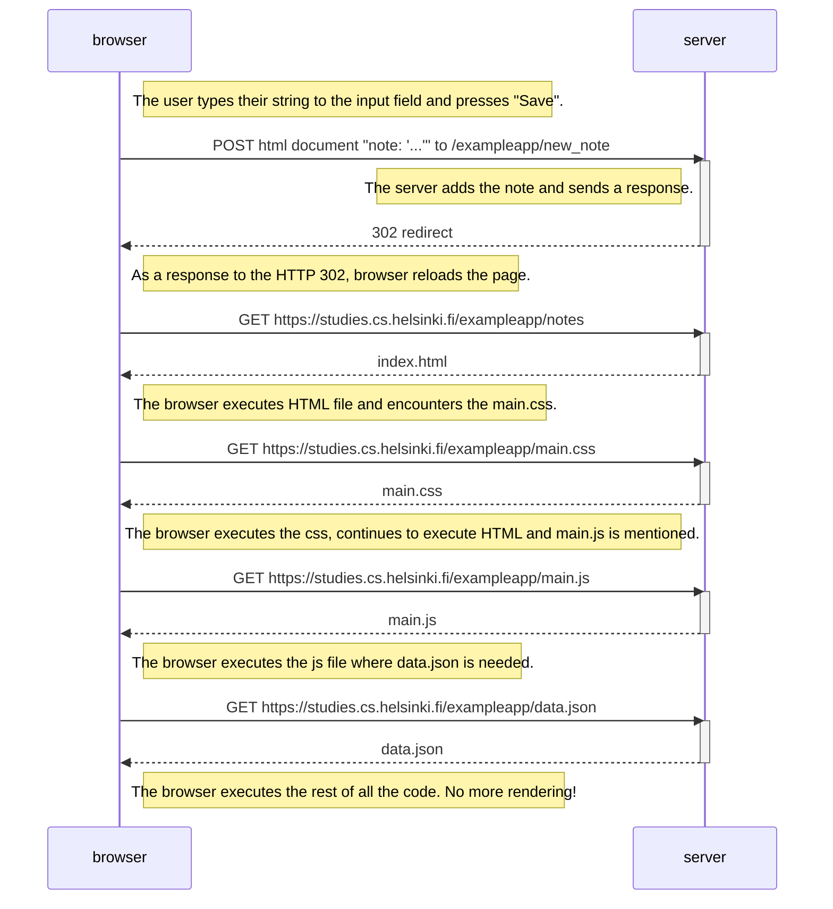

```mermaid
sequenceDiagram
    participant browser
    participant server

    Note right of browser: The user types their string to the input field and presses "Save".
    
    browser->>server: POST html document "note: '...'" to /exampleapp/new_note
    activate server

    Note left of server: The server adds the note and sends a response.

    server-->>browser: 302 redirect
    deactivate server

    Note right of browser: As a response to the HTTP 302, browser reloads the page.

    browser->>server: GET https://studies.cs.helsinki.fi/exampleapp/notes
    activate server
    server-->>browser: index.html
    deactivate server

    Note right of browser: The browser executes HTML file and encounters the main.css.

    browser->>server: GET https://studies.cs.helsinki.fi/exampleapp/main.css
    activate server
    server-->>browser: main.css
    deactivate server

    Note right of browser: The browser executes the css, continues to execute HTML and main.js is mentioned.

    browser->>server: GET https://studies.cs.helsinki.fi/exampleapp/main.js
    activate server
    server-->>browser: main.js
    deactivate server

    Note right of browser: The browser executes the js file where data.json is needed.

    browser->>server: GET https://studies.cs.helsinki.fi/exampleapp/data.json
    activate server
    server-->>browser: data.json
    deactivate server

    Note right of browser: The browser executes the rest of all the code. No more rendering!
```
