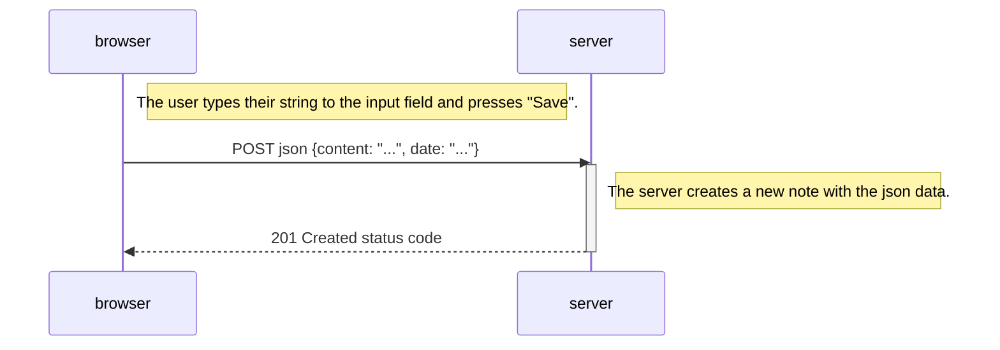

```mermaid
sequenceDiagram
    participant browser
    participant server

    Note right of browser: The user types their string to the input field and presses "Save".
    
    browser->>server: POST json {content: "...", date: "..."}
    activate server

    Note right of server: The server creates a new note with the json data.

    server-->>browser: 201 Created status code
    deactivate server
```
